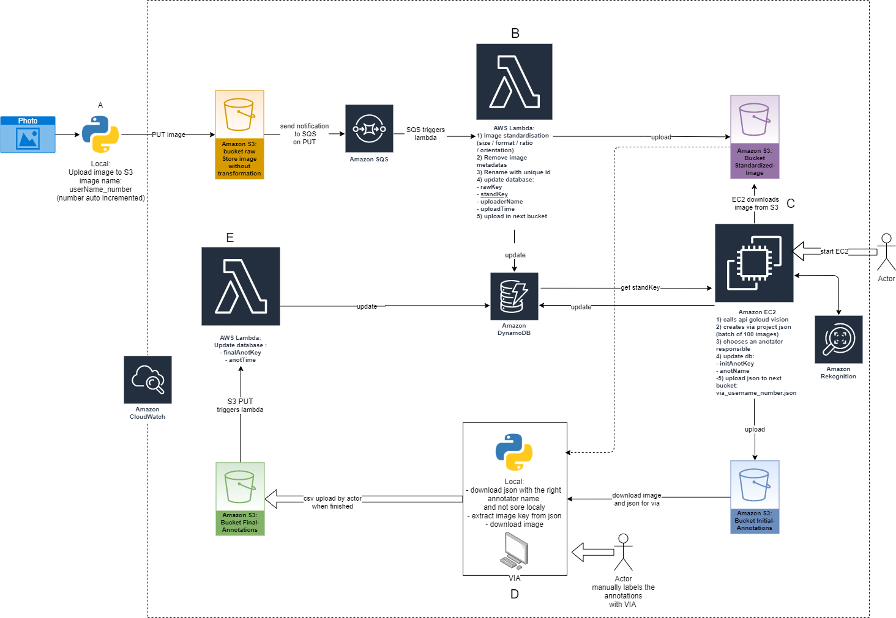

# :eye: Opteeq

# Description

Opteeq is a library and web application that digitalises paper receipts. It automatically scans receipts using Google Vision, formats and labels them, then uses a text detection model (TBD) to store and extracts key information. 

Data is stored in Amazon Simple Storage Service (S3) cloud storage buckets, and key information is extracted and saved to a noSQL database using Amazon DynamoDB. 

# AWS structure



# Table of Contents
Installation

[Usage](#usage) 

Step 1: Data labelling architecture

   1.1 Image uploading

   1.2 Image standardization

   1.3 Image auto-annotation

   1.4 Manual labelling

   1.5 Data uploading

Step 2: AI modelling (TBD)

Step 3: Web application deployment (TBD)

Database structure

Project cost estimation


License

Team

# Installation / Configuration

Currently installation for each task is discussed below in each section in Usage -- should this be compiled together in this section later?

# Usage 

## Step 1: Data labelling architecture

### 1.1 Image uploading
Python is used to rename and upload raw images (.jpeg, .png, .tiff) of receipts into an S3 bucket `bucket_raw` 

#### 1.1.1 Rename images

Rename all the files from a folder and upload it to `bucket_raw`
```
`pip3 install -r requirements.txt`
config conf.json
`python3 rename_upload.py`
```

#### 1.1.2 Import raw images
```                                         
import json
import os
import pathlib
from tools.aws.awsTools import Bucket
from tqdm import tqdm

def upload(user: str, folder: str, start: int, bucket_raw: str):
    
    """
    Upload all the files of folder in AWS bucket, rename file with user name and number auto increment
    :param user: user name
    :param folder: folder to upload
    :param start: start for auto increment
    :param bucket_raw: name bucket
    :return: the final number auto increment in order to save it
    """
    bucket = Bucket(bucket_raw)
    for filename in tqdm(os.listdir(folder), "upload"):
        bucket.upload(os.path.join(folder, filename),
                      f"{user}_{start}{pathlib.Path(filename).suffix}")
        start += 1
    return start


if __name__ == '__main__':
    # take all parameter in conf.json, allow to save the position since the last execution
    # and execute directly with python3 rename_upload.py in console
    with(open("conf.json", "r")) as f:
        conf = json.load(f)
    if conf["user"] and conf["bucket_raw"]:
        conf["start"] = upload(conf["user"], conf["folder"], conf["start"], conf["bucket_raw"])
        with open("conf.json", "w") as f:
            json.dump(conf, f)
    else:
        print("Config conf.json before use upload!")
```

**All images in folder image (or other defined image folder) are imported. Take note of the request ID number !**


### 1.2 Image standardization

Raw images are transformed using an AWS Lambda function into standardized images.The Lambda function runs on an S3 trigger based on a put event (the file upload). Image standardization includes a minimum image size check, image resizing, text orientation detection and rotation. 

*The steps include:*

1. Raw images are read from `bucket_standardized` using Boto3 and OpenCV. 
2. The text orientation of the image is checked
3. The image is rotated if needed
4. The image size is compared with the Google Cloud Vision API recommended image size for document text recognition (1067x768) 
5. The image is resized either using height or width (1067 or 768) while keeping the same aspect ratio to avoid distorting the image 
6. The processed image is written locally to ‘tmp’ directory with a unique filename - ‘IMG-{uuid4}-{unix_timestamp}.jpg’ using OpenCV. 
7. Additional datapoints are added to the database including a unique ID, image name, row name, and uploader name. 

Standardized images are then pushed (uploaded) into `bucket_standardized` using Boto3. 

### 1.3 Image automatic pre-annotation
Google Cloud Vision Optical Character Recognition (OCR) API is called to pre-annotate the pictures with boxes arount the text. Annotations from Google Vision are then converted by batch to a json file that can be imported in [VGG Image Annotator](https://www.robots.ox.ac.uk/~vgg/software/via/). 
The goal of this step is essentially to reduce and ease the manual labelling of the pictures that will be done in the next step.

Before using edit conf.json. you need to edit:

1. `user`: your username.
2. `bucket_raw`: bucket where raw image are upload
3. `bucket_standardized`: bucket where standardized image are upload
4. `bucket_initial_annotation`: bucket where initial json annotation are uploaded
5. `dynamoDB`: region and table name
6. `profile`: choose the profile to use if many CLI profile are set up on your computer otherwise let `default`.

To add another profile `aws configure --profile profilName` to list available profiles `aws configure list-profiles`

If the part that you will use doesn't need one of these parameters you can ignore it.

When you create the dynamoDB add a global secondary index on anotName and named annotator-index.

#### 1.3.2 Set up Google vision and annotator

1. `pip3 install -r requirements.txt`
2. Set up [google cloud vision](https://cloud.google.com/vision/docs/quickstart-client-libraries)
3. `python3 ec2.py` to do the conversion locally without EC2 you can use  `via_json_local` function (
   tools/via/via_converter.py). User data for EC2 (compatible Debian and Ubuntu):
   ```
   #!/bin/bash
   sudo apt update
   sudo apt install python3-pip -y
   cd home/$USER
   git clone https://github.com/assansanogo/Opteeq.git
   cd Opteeq
   pip3 install -r requirements.txt
   ```

4. Go to [VGG Image Annotator 2](https://www.robots.ox.ac.uk/~vgg/software/via/via.html), **open a VIA project** and
   choose output.json. (If the image file can't be find, download the HTML file and change the default path in the settings)

##### 1.3.3 Example of results

|    |            |   |
|----------|:-------------:|------:|
|          |               |       |

### 1.4 Manual labelling 
Json files are manually labelled using VGG Annotator (?) by team members. Annotated json files are uploaded into **AWS Bucket 3**.

Download all image and json for a given annotator name.

1. `pip3 install -r requirements.txt`
2. config conf.json
3. `python3 download.py`

### 1.5 Data uploading
Final database is exported as a .csv file.

## Step 2: AI modelling (TBD)
- Build AI model to detect and crop external region of interest before standardisation

## Step 3: Web application deployment (TBD)

:::info
Please add details
:::

# Database structure 

:::info
Please add details
:::

# Sphinx Documentation

The documentation is in the docs folder. It is also hosted [here](https://souff.github.io/Opteeq/build/info.html).

To generate documentation:

1. Edit the README.md or the different docStrings. You can also add a reStructuredText file (rst) or markdown (md) file
   in source.
2. Install required python library `pip3 install -r requirements.txt`. You need sphinx, sphinx_rtd_theme and
   myst_parser.
3. `sphinx-build -b html docs/source docs/build/html `

# Project cost estimation

| Product | Description | Cost (USD/month) |
| -------- | -------- | -------- |
| AWS S3 Buckets    | Cloud storage | 1,38    |
Amazon Simple Queue Service (SQS)    | web service for storing messages in transit between computers      | 0,01    | |
Amazon Lambda Function    | serverless compute service that runs code in response to events       | 0,44    ||
Amazon Elastic Compute Cloud (Amazon EC2)    | allows users to rent virtual computers to run their own computer applications      | 1,01    ||
Rekognition    | API for text detection image processing      | 10,00   ||
Cloudwatch    | monitoring and management service for AWS      | 2,58   ||
DynamoDB   | NoSQL database service      | 0,04   ||
TOTAL    | total cost for first month without free tier      | $15,46   |

**Notes:**
- With Free-tier, total costs should be below $10 for 10,000 images.
- After labelling, the files will be moved to Glacier as a zip.

# License

:::info
Do we need this section?
:::

# Team
This project was developed for the DSTI S21 Python Labs class by XXX..

