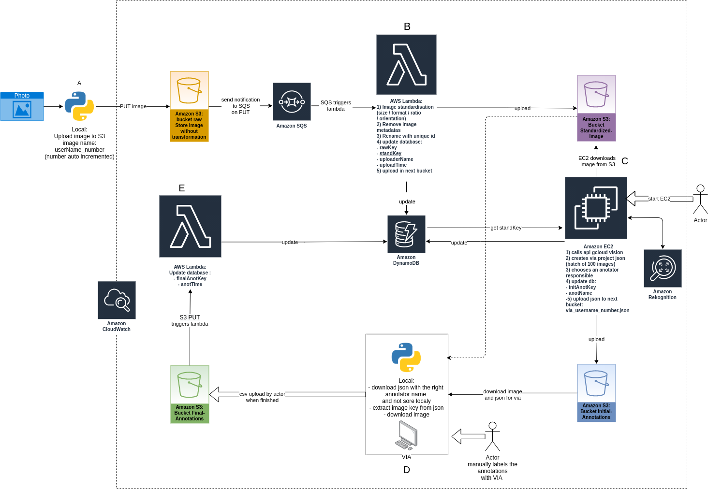
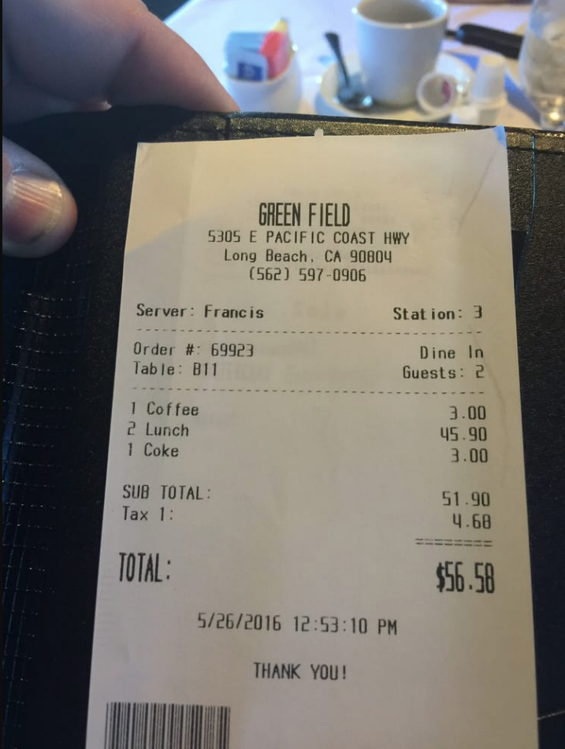

# Description

Opteeq is a student project that uses computer vision and AI modeling for receipt digitalisation.

**Objective**: To build a receipt digitalization app that extracts key information (
Place, Date and Total amount of expense) from paper receipts.

**Methodology**

1. Data preparation with AWS pipeline (finished)
2. AI modelling with YOLOv4 and CUTIE (ongoing)
3. Web application interface deployment (not started)

# Table of Contents

[Installation / Configuration](#installation--configuration)

[Step 1: Data preparation with AWS pipeline](#step-1-data-preparation-with-aws-pipeline)

[Step 2: AI modelling with YOLOv4 and CUTIE](#step-2-ai-modelling-with-yolov4-and-cutie)

[Step 3: Web application deployment (TBD)](#step-3-web-application-deployment-tbd)

[License](#license)

[Team](#team)

# Installation / Configuration

## get the project from the repository:

```shell
git clone https://github.com/assansanogo/Opteeq.git
```

## Install library requirements

```shell
pip3 install -r requirements.txt
```

## Config the aws cli:

To add another profile `aws configure --profile profilName` to list available profiles `aws configure list-profiles`.

## Config the project

Before using edit conf.json. you need to edit:

1. `user`: your username.
2. `bucket_raw`: bucket where raw image are upload
3. `bucket_standardized`: bucket where standardized image are upload
4. `bucket_initial_annotation`: bucket where initial json annotation are uploaded
5. `dynamoDB`: region and table name
6. `profile`: choose the profile to use if many CLI profile are set up on your computer otherwise let `default`.

To add another profile `aws configure --profile profilName` to list available profiles `aws configure list-profiles`

If the part that you will use doesn't need one of these parameters you can ignore it.

When you create the dynamoDB add a global secondary index on anotName and named annotator-index.

# Step 1: Data preparation with AWS pipeline

A database of ~1300 ticket pictures has been collected. In order to help with the tedious labelling work, a pipeline has
been developped in AWS to pre-annotate the pictures.   
Each receipt added to the database is standardized and scanned using AWS Rekognition for text recognition. The pipeline
then reformats the annotations and computes JSON files containing batches of 20 images. These JSON files can be imported
into VGG Image Anotator for the final manual part of the labelling.

All the data is stored in Amazon Simple Storage Service (S3) cloud storage buckets, and key information is extracted and
saved to a noSQL database using Amazon DynamoDB.

## AWS structure



## 1.1 Image uploading

Python script is used to rename and upload all raw images (.jpeg, .png, .tiff) of receipts into an S3
bucket `bucket_raw` and rename them with the name of the uploader and an index.

## 1.2 Image standardization

Raw images are transformed using an AWS Lambda function into standardized images.The Lambda function runs on an S3
trigger based on a put event (the file upload). Image standardization includes a minimum image size check, image
resizing, text orientation detection and rotation.

*The steps include:*

1. Raw images are read from `bucket_standardized` using Boto3 and OpenCV.
2. The text orientation of the image is checked
3. The image is rotated if needed
4. The image size is compared with the Google Cloud Vision API recommended image size for document text recognition (
   1067x768)
5. The image is resized either using height or width (1067 or 768) while keeping the same aspect ratio to avoid
   distorting the image
6. The processed image is written locally to ‘tmp’ directory with a unique filename - ‘IMG-{uuid4}-{unix_timestamp}.jpg’
   using OpenCV.
7. Additional datapoints are added to the database including a unique ID, image name, raw name, and uploader name.

Standardized images are then pushed (uploaded) into `bucket_standardized` using Boto3.

## 1.3 Image automatic pre-annotation

AWS Rekognition API is called to pre-annotate the pictures with boxes around the text. Annotations from Rekognition are
then converted by batch to a json file that can be imported
in [VGG Image Annotator](https://www.robots.ox.ac.uk/~vgg/software/via/). The goal of this step is essentially to reduce
and ease the manual labelling of the pictures that will be done in the next step.

### 1.3.1 Example of results

|    |            |   |
|----------|:-------------:|------:|
|          |               |       |

## 1.4 Manual labelling

JSON files are imported in VGG Image Annotator. The only remaining part is to assign the Date, Place and Total Amount
classes to the relevant boxes. This is perfomed manually by team members. Final annotations are exported as csv files
and uploaded into **AWS Bucket 3**. A Lambda function runs on an S3 trigger based on a put event to update the database
for all the pictures found in the annotation file.

## 1.5 Pipeline cost estimation

| Product                                   | Description                                                                   | Cost (USD/month) |
|-------------------------------------------|-------------------------------------------------------------------------------|------------------|
| AWS S3 Buckets                            | Cloud storage                                                                 | 1,38             |
| Amazon Simple Queue Service (SQS)         | web service for storing messages in transit between computers                 | 0,01             | |
| Amazon Lambda Function                    | serverless compute service that runs code in response to events               | 0,44             ||
| Amazon Elastic Compute Cloud (Amazon EC2) | allows users to rent virtual computers to run their own computer applications | 1,01             ||
| Rekognition                               | API for text detection image processing                                       | 10,00            ||
| Cloudwatch                                | monitoring and management service for AWS                                     | 2,58             ||
| DynamoDB                                  | NoSQL database service                                                        | 0,04             ||
| TOTAL                                     | total cost for first month without free tier                                  | $15,46           |

**Notes:**

- With Free-tier, total costs should be below $10 for 10,000 images.
- After labelling, the files will be moved to Glacier as a zip.

## Usage

You can use all this script with the command behind or use the notebook pipeline if you prefer.

All this script is in a package it is recommended to lunch them with `-m`. If you don't use `-m` you can have import
error or path error.

### Upload image

1. put the image in the image folder
2. execute
   ```shell
   `python3 -m pipeline_aws.rename_upload`
   ```

### Generate JSON for via

1. Start the Ec2 with this user data (compatible Debian and Ubuntu):

   ```shell
   #!/bin/bash
   sudo apt update
   sudo apt install python3-pip -y
   cd home/$USER
   git clone https://github.com/assansanogo/Opteeq.git
   cd Opteeq
   pip3 install -r requirements.txt
   ```

2. execute:
   ```shell
   python3 -m pipeline_aws.ec2
   ```

### Download image and JSON

1. Execute:

      ```shell
      python -m pipeline_aws.download
      ```

2. Go to [VGG Image Annotator 2](https://www.robots.ox.ac.uk/~vgg/software/via/via.html), **open a VIA project** and
   choose output.json. (If the image file can't be found, download the HTML file and change the default path in the
   settings)

# Step 2: AI modelling with YOLOv4 and CUTIE

## 2.1 YOLOv4

YOLOv4 (You Only Look Once version 4) is a one-stage object detection model that improves on YOLOv3 with several bags of tricks and modules introduced in the literature.

The original YOLO is a clever Convolution Neural Network (CNN) for doing object detection in real-time. Its algorithm applies a single neural network to the full image,  divides the image into regions and predicts bounding boxes and probabilities for each region.

### 2.1.1 Data preprocessing

- Johann add details
-

### 2.1.2 Installation

If you don't want to use docker you can pass this steps and compile Darket directly (more
information [here](https://github.com/AlexeyAB/darknet))

#### 2.1.2.1 Install Nvidia docker

1. Install [docker](https://docs.docker.com/engine/install/)
   and [docker compose](https://docs.docker.com/compose/install/)
2. Install Nvidia driver (use your package manager and distribution
   documentation ([debian](https://wiki.debian.org/fr/NvidiaGraphicsDrivers)
   , [other](https://docs.nvidia.com/datacenter/tesla/tesla-installation-notes/index.html)...))
3. Install
   [nvidia docker](https://docs.nvidia.com/datacenter/cloud-native/container-toolkit/install-guide.html#install-guide)**

** Nvidia docker is only available on: Amazon Linux, Open Suse, Debian, Centos, RHEL and Ubuntu.

#### 2.1.2.2 Build the docker image

```shell
docker-compose build
```

### 2.1.3 Model training

1. put the image with annotation file in data/obj folder
2. create train, validation and testing set

```shell
python3 process.py
```

3. add pretrained weight in the data folder

```shell
cd yolo/docker/data/
wget https://github.com/AlexeyAB/darknet/releases/download/darknet_yolo_v3_optimal/yolov4.weights
```

4. Start the container

```shell
docker-compose up -d
```

3. Enter in bash (replace container_name by the name of the container)

```shell
docker exec -it container_name bash
```

4. launch training

```shell
cd /home/data
darknet detector train /home/data/obj.data /home/data/yolov4-custom.cfg /home/data/yolov4.conv.137 -dont_show -map
```

### 2.1.4 Model evaluation

1. Put the testing set path in the obj.data for valid and run

```shell
darknet detector map /home/data/obj.data /home/data/yolov4-custom.cfg /home/data/trainning/yolov4-custom_best.weights
```


### 2.1.4 Detection

If you want to use detection without docker replace libdarknet.so (in the yolo file of the repository opteeq) by your
libdarknet.so obtained after compilation. (you can't use the libdarknet.so of the repository)

To get the image with a bounding box and the text extract

```shell
python3 predict.py
```


### 2.1.4 Detection without darknet framework

Deploy this model in web application is complicated because it depends on darknet framework. In order to have an
serverless architecture it is better to avoid the dependencies to darknet.

In this part I use only OpenCv to make the prediction (more information to use darknet directly with
opencv [here](https://opencv-tutorial.readthedocs.io/en/latest/yolo/yolo.html)).

1. get the weights after training
2. edit path in `predict_opencv.py` for yolo config file
3.

```shell
python3 predict_opencv.py
```

## 2.2 CUTIE

### 2.2.1 Data preprocessing

### 2.1.2 Model training

## 2.3 Models Benchmarking

## 2.4 Conclusion

# Step 3: Web application deployment (TBD)

:::info Please add details
:::

# License

:::info TBD
:::

# Team

This project was developed for the DSTI S21 Python Labs class by XXX..

# Sphinx Documentation

The documentation is in docs folder. It is also hosted [here](https://assansanogo.github.io/Opteeq/build/html/info.html)
.

To generate documentation:

1. Edit the README.md or the different docStrings. You can also add a reStructuredText file (rst) or markdown (md) file
   in source.
2. Install required python library `pip3 install -r requirements.txt`. You need sphinx, sphinx_rtd_theme and
   myst_parser.
3. `sphinx-build -b html docs/source docs/build/html `
